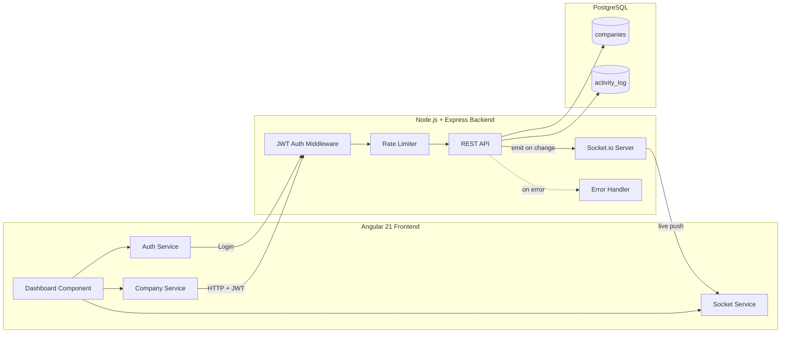

# InvestSync

Real-time investment/company pipeline tracker built for a PE/VC-style workflow — live updates, secure write access, and a full audit trail.

## Overview

InvestSync lets a team track companies through investment stages (`In Review` → `Due Diligence` → `Invested` / `Passed`), see aggregate portfolio stats, and watch changes propagate live across every connected client — no refresh needed. Every create, update, and delete is logged to an audit feed.

## Architecture



## Tech Stack

| Layer | Technology |
|---|---|
| Frontend | Angular 21 (standalone, zoneless, signals) |
| Backend | Node.js, Express |
| Database | PostgreSQL |
| Real-time | Socket.io |
| Auth | JWT + bcrypt |
| Security | express-rate-limit, centralized error handling |

## Features

- ✅ Full CRUD on companies with server-side search, filtering, and pagination
- ✅ Real-time broadcast of create/update/delete events via WebSockets
- ✅ JWT-authenticated write operations (read access is public)
- ✅ Audit trail — every mutation logged to `activity_log`, streamed live
- ✅ Aggregate stats endpoint (total companies, total portfolio value, breakdown by stage)
- ✅ Rate limiting (general + stricter login-specific limiter)
- ✅ Centralized error handling with async wrapper (no repeated try/catch)

## Project Structure

```
investsync/                  # backend
├── controllers/
│   └── companyController.js
├── routes/
│   ├── companyRoutes.js
│   └── authRoutes.js
├── middleware/
│   ├── auth.js
│   ├── asyncHandler.js
│   └── errorHandler.js
├── db/
│   ├── pool.js
│   ├── query.js
│   ├── activityLog.js
│   └── schema.sql
├── server.js
└── .env.example

investsync-frontend/         # frontend (separate repo)
├── src/app/
│   ├── components/
│   │   ├── dashboard/
│   │   └── login/
│   ├── services/
│   │   ├── company.ts
│   │   ├── socket.ts
│   │   └── auth.ts
│   └── interceptors/
│       └── auth-interceptor.ts
```

## Setup

### Backend

```bash
git clone <this-repo-url>
cd investsync
npm install
```

Create `.env` from `.env.example`:

```
DB_USER=postgres
DB_HOST=localhost
DB_NAME=investsync
DB_PASSWORD=your_password
DB_PORT=5432
JWT_SECRET=your_long_random_secret
ADMIN_USERNAME=admin
ADMIN_PASSWORD_HASH=generate_with_bcrypt
```

Generate the admin password hash:

```bash
node -e "console.log(require('bcryptjs').hashSync('yourpassword', 10))"
```

Create the database and run the schema:

```bash
psql -U postgres -c "CREATE DATABASE investsync;"
psql -U postgres -d investsync -f db/schema.sql
```

Start the server:

```bash
node server.js
```

### Frontend

```bash
git clone <frontend-repo-url>
cd investsync-frontend
npm install
ng serve
```

Visit `http://localhost:4200`. Log in with the admin credentials set above to unlock create/edit/delete.

## API Reference

| Method | Endpoint | Auth Required | Body | Description |
|---|---|---|---|---|
| POST | `/auth/login` | No | `{ username, password }` | Returns JWT token |
| GET | `/companies` | No | — | List companies (supports `?search=&stage=&page=&limit=`) |
| GET | `/companies/stats` | No | — | Aggregate portfolio stats |
| GET | `/companies/activity` | No | — | Last 20 activity log entries |
| POST | `/companies` | **Yes** | `{ name, sector, stage, metric_value }` | Create company |
| PUT | `/companies/:id` | **Yes** | `{ name, sector, stage, metric_value }` | Update company |
| DELETE | `/companies/:id` | **Yes** | — | Delete company |

All authenticated routes require header: `Authorization: Bearer <token>`

## Real-Time Events (Socket.io)

| Event | Payload | Fired When |
|---|---|---|
| `companyCreated` | Company object | A company is created |
| `companyUpdated` | Company object | A company is updated |
| `companyDeleted` | Company object | A company is deleted |
| `activityLogged` | Activity log entry | Any mutation completes |

## Design Notes

- **Why raw `pg` over an ORM:** kept the SQL explicit and close to what's used in production PE/VC-style reporting queries (aggregates, dynamic filters) rather than abstracting it behind an ORM.
- **Why a connection pool:** avoids serializing concurrent requests onto a single DB connection — critical once multiple clients are hitting the API simultaneously (which happens constantly here, given the real-time nature of the app).
- **Why Socket.io over raw WebSockets:** built-in reconnection handling, room/broadcast abstractions, and fallback transport — directly extends the raw Java socket/multithreading model from an earlier project (SockItChat) into a production-grade real-time layer.
- **Why login gates the whole UI, not just write buttons:** a deliberate simplification for this scope — a real product would let anyone view the dashboard and only gate mutating actions.

## Author

Kushal Ramsinghani — [GitHub](https://github.com/kushal-ramsinghani23)