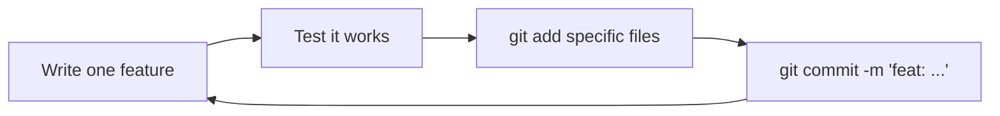

# Phase 0 — Setup & Git Foundations

## Narration
This is where InvestSync started. Nothing existed yet — just a plan (Node.js, Express, PostgreSQL, Angular, Socket.io) and a resume gap to fill (Kelp's JD needs Node/Express/Angular/Postgres/sockets). Before writing a single line of app code, we set up the repo properly: initialized Node, created `.gitignore`, and locked in a git commit convention we'd use for the entire project. Next: Phase 1, where we actually install Express and write the first server.

## Navigation
- [What We Set Up](#what-we-set-up)
- [Why `npm init`](#why-npm-init)
- [Why `.gitignore` Matters](#why-gitignore-matters)
- [The Git Commit Convention](#the-git-commit-convention)
- [Key Points to Remember](#key-points-to-remember)
- [Docs to Reference](#docs-to-reference)
- [Phase Summary](#phase-summary)

---

## What We Set Up

```bash
mkdir investsync && cd investsync
git init
npm init -y
```

Then a `.gitignore`:
```
node_modules/
.env
```

## Why `npm init`

`npm init -y` creates `package.json` — Node's project manifest. It tracks:
- Project metadata (name, version)
- Dependencies (and their versions)
- Scripts (`npm start`, `npm run build`, etc.)

**Mental model (Java comparison):** this is the Node equivalent of `pom.xml` (Maven) or `build.gradle` (Gradle) in a Spring Boot project — the single source of truth for "what does this project need to run."

### Interview Explanation
> "`package.json` is Node's dependency manifest — similar to a `pom.xml` in Maven. It lists every package the project depends on, their versions, and any custom scripts. When you clone a Node project, `npm install` reads this file and rebuilds the entire `node_modules` folder from it."

## Why `.gitignore` Matters

Two things we excluded, and why:

| Excluded | Reason |
|---|---|
| `node_modules/` | Auto-generated from `package.json` — huge, and 100% reproducible via `npm install`. Never commit generated/derived files. |
| `.env` | Holds secrets (DB password, JWT secret, admin password hash). Committing this would leak credentials to anyone with repo access — including on public GitHub. |

### Interview Explanation
> "I gitignore `node_modules` because it's fully reproducible from `package.json` via `npm install` — committing it just bloats the repo. I gitignore `.env` because it holds real secrets; instead I commit a `.env.example` with placeholder values so anyone cloning the repo knows what variables they need to set, without ever seeing the actual secrets."

## The Git Commit Convention

We used **Conventional Commits** style, one commit per file/feature:

| Prefix | Meaning |
|---|---|
| `feat:` | New feature/functionality |
| `fix:` | Bug fix |
| `docs:` | Documentation only |
| `chore:` | Config, setup, dependencies, boilerplate |
| `refactor:` | Code restructuring, no behavior change |
| `style:` | Formatting/CSS, no logic change |

**Rule enforced throughout the project:** commit as soon as one file/feature works — never batch unrelated changes into one commit.



### Interview Explanation
> "I followed Conventional Commits throughout — `feat`, `fix`, `chore`, `docs`, `refactor`, `style` — with a strict one-commit-per-feature rule. This makes the git history itself readable documentation: anyone can scan the log and understand exactly what was built and in what order, without reading a single line of code."

## Key Points to Remember
- `package.json` is created once, updated automatically every time you `npm install` something new.
- `.gitignore` should be set up **before** your first commit — if you commit `node_modules` or `.env` by accident, removing them from git history afterward is much more painful (`git rm --cached`, or worse, history rewriting).
- Conventional commit prefixes aren't enforced by git itself — they're a discipline you maintain, but tools like `commitlint` can enforce them automatically in real teams.

## Docs to Reference
- [npm package.json docs](https://docs.npmjs.com/cli/v10/configuring-npm/package-json)
- [Conventional Commits spec](https://www.conventionalcommits.org/en/v1.0.0/)
- [GitHub's official .gitignore templates](https://github.com/github/gitignore)

---

## Phase Summary
Phase 0 established the project's foundation: a proper Node project manifest, correct exclusion of generated/secret files, and a disciplined commit convention followed for the rest of the build. Nothing functional was built yet — this phase is about professional project hygiene, which is exactly what shows up as "clean git history" and "properly scoped `.gitignore`" when an interviewer looks at your repo.

**Next: Phase 1 — Node.js & Express Fundamentals.**
