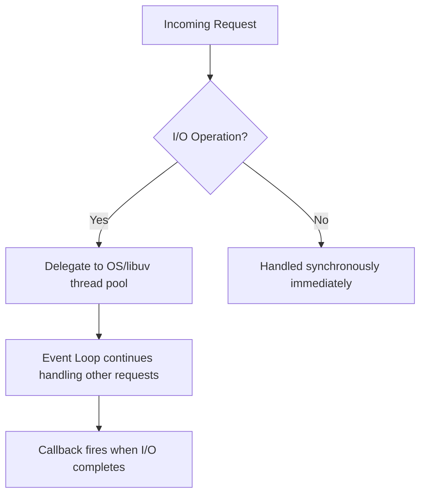

# Phase 1 — Node.js & Express Fundamentals

## Narration
Phase 0 gave us a clean repo. Now we build the actual server. This phase covers what Node.js and Express fundamentally are, how middleware works (and why order matters — we hit this directly with `express.json()`), and how we structured the project into `routes/controllers/models/db` folders to mirror the separation of concerns you already know from Spring Boot. By the end of this phase we had a running Express server responding on `localhost:3000`. Next: Phase 2, where we connect that server to PostgreSQL.

## Navigation
- [What Node.js Actually Is](#what-nodejs-actually-is)
- [Express as a Layer Over Node](#express-as-a-layer-over-node)
- [The First Server](#the-first-server)
- [Middleware — The Core Concept](#middleware--the-core-concept)
- [Why Order Matters](#why-order-matters)
- [Folder Structure Decisions](#folder-structure-decisions)
- [Key Points to Remember](#key-points-to-remember)
- [Docs to Reference](#docs-to-reference)
- [Phase Summary](#phase-summary)

---

## What Node.js Actually Is

Node.js is a JavaScript runtime built on Chrome's V8 engine, designed around an **event loop** and **non-blocking I/O**. Instead of spawning a new OS thread per request (like a traditional Java servlet container might), Node runs on a single thread and handles I/O (database calls, file reads, network requests) asynchronously — when an I/O operation is in progress, Node moves on to handle other work and comes back via a callback/Promise when the result is ready.



### Interview Explanation
> "Node.js runs JavaScript outside the browser, using an event loop and non-blocking I/O. Unlike a traditional multi-threaded server where each request might get its own thread, Node handles concurrency on a single thread by delegating I/O operations (like a database query) and continuing to process other requests while waiting for the result. This makes it very efficient for I/O-heavy workloads like REST APIs."

## Express as a Layer Over Node

Express is a minimal routing/middleware framework built on top of Node's raw `http` module. Where Node's `http` module gives you the bare request/response objects, Express adds:
- Clean route definitions (`app.get`, `app.post`, etc.)
- A middleware chain
- Easier request/response helpers (`res.json()`, `req.body`, etc.)

**Mental model (Spring Boot comparison):** `express()` creating an `app` object is roughly equivalent to combining your `@SpringBootApplication` class and `@RestController` annotations into one object — except Express doesn't use reflection/annotation scanning; you wire routes explicitly in code.

### Interview Explanation
> "Express sits on top of Node's raw HTTP server and gives you a clean way to define routes and middleware. It's conceptually similar to Spring MVC's `@RestController` + `@RequestMapping`, but instead of annotations and reflection-based scanning, you register routes explicitly — `app.get('/path', handler)` — which makes the routing logic more visible in code."

## The First Server

```js
const express = require('express');
const app = express();

app.get('/', (req, res) => {
  res.send('InvestSync API running');
});

const PORT = 3000;
app.listen(PORT, () => {
  console.log(`Server running on http://localhost:${PORT}`);
});
```

- `require('express')` — Node's CommonJS import system.
- `express()` — creates the app object (your router + config).
- `app.get('/', handler)` — registers a route. Equivalent to `@GetMapping("/")` in Spring.
- `app.listen(PORT, callback)` — starts the actual HTTP server. Equivalent to `SpringApplication.run()`.

## Middleware — The Core Concept

Middleware is a function that runs on **every** incoming request before it reaches the route handler. Each middleware can inspect/modify the request or response, then either call `next()` to pass control forward, or end the response itself.

```js
app.use(cors());
app.use(express.json());
```

- **`cors()`** — adds headers so cross-origin requests (Angular on port 4200 calling Express on port 3000) aren't blocked by the browser's Same-Origin Policy.
- **`express.json()`** — parses incoming JSON request bodies and attaches the result to `req.body`. Without it, `req.body` is `undefined`.


### Interview Explanation
> "Middleware in Express is a chain of functions that every request passes through before reaching the actual route handler. Each middleware can transform the request, add data to it, or short-circuit the response entirely. It's conceptually similar to a Servlet Filter or Interceptor in Spring — code that runs before your controller method, except Express makes the entire chain explicit and composable rather than hiding it behind annotations."

## Why Order Matters

This was directly tested: if `app.use(express.json())` is placed **after** route definitions, `req.body` is `undefined` in those routes — because nothing had parsed the raw request body yet by the time the route ran. Express executes middleware strictly top-to-bottom, in registration order.

**Rule: order = execution order, no exceptions.**

### Interview Explanation
> "Express middleware runs in the exact order it's registered — there's no reordering or priority system. If you register your body-parsing middleware after your routes, those routes will never see a parsed `req.body`, because the parsing middleware never got a chance to run first. This makes middleware order a real source of subtle bugs if you're not careful."

## Folder Structure Decisions

```
routes/       → which URL maps to which handler (like @RequestMapping)
controllers/  → actual handler logic (like @RestController method bodies)
models/       → data shape / schema definitions (like @Entity classes)
db/           → database connection setup (like a DataSource bean)
```

### Interview Explanation
> "I structured the backend into routes, controllers, models, and a db layer — mirroring the separation of concerns you'd get automatically in a Spring Boot project, except done explicitly since Express doesn't enforce or provide this structure itself."

## Key Points to Remember
- Node is single-threaded for JS execution, but I/O is delegated and non-blocking — this is *not* the same as multi-threading, it's cooperative concurrency via the event loop.
- `app.use()` without a path applies to **every** route; `app.use('/path', middleware)` scopes it.
- Middleware order is registration order — always register body parsers and CORS before your routes.
- Express itself doesn't enforce any folder structure — it's a convention you choose, not something the framework provides.

## Docs to Reference
- [Node.js Event Loop official guide](https://nodejs.org/en/learn/asynchronous-work/event-loop-timers-and-nexttick)
- [Express official routing guide](https://expressjs.com/en/guide/routing.html)
- [Express middleware guide](https://expressjs.com/en/guide/using-middleware.html)
- [cors npm package docs](https://www.npmjs.com/package/cors)

---

## Phase Summary
Phase 1 built the actual Express server: understanding Node's event-loop model, Express's role as a routing/middleware layer over raw Node, the middleware chain concept (and the real bug we hit around parsing order), and a clean folder structure mirroring Spring Boot's layered architecture. By the end, we had a live server on port 3000 responding to a basic route.

**Next: Phase 2 — PostgreSQL & Database Layer.**
