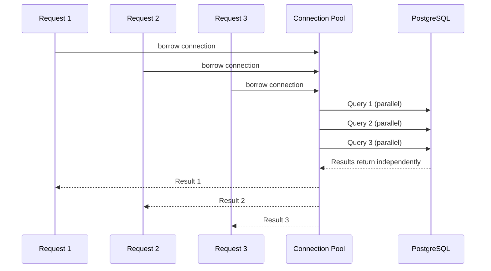

# Phase 2 — PostgreSQL & Database Layer

## Narration
With Express running, we needed a database. You already knew PostgreSQL from Blogar CMS and TextbookAI, so this phase was mostly about connecting Postgres to Node specifically — installing the `pg` driver, building a connection pool (and understanding *why* pooling matters, not just using it), and designing the `companies` schema. We tested the full chain (Express → pool → Postgres → JSON response) with a throwaway `/test-db` route before building real features on top. Next: Phase 3, where we build the actual CRUD REST API on this foundation.

## Navigation
- [Why PostgreSQL Here](#why-postgresql-here)
- [Installing `pg` and Building the Pool](#installing-pg-and-building-the-pool)
- [Connection Pool vs Single Client](#connection-pool-vs-single-client)
- [Schema Design Decisions](#schema-design-decisions)
- [The DB Query Helper](#the-db-query-helper)
- [Testing the Full Chain](#testing-the-full-chain)
- [Key Points to Remember](#key-points-to-remember)
- [Docs to Reference](#docs-to-reference)
- [Phase Summary](#phase-summary)

---

## Why PostgreSQL Here

PostgreSQL over MySQL, specifically because:
- Native strong support for advanced indexing (GIN/GiST — already used for full-text search in Blogar CMS)
- Better standards compliance and stronger concurrency model (MVCC)
- `RETURNING *` clause — lets an `INSERT`/`UPDATE`/`DELETE` hand back the affected row in the same round trip, without needing a follow-up `SELECT`

### Interview Explanation
> "I chose PostgreSQL because it's what I already had production experience with, and it has genuine advantages here — like `RETURNING *`, which lets you get the inserted/updated row back in the same query instead of a second round trip, and stronger support for advanced indexing if the dataset grows."

## Installing `pg` and Building the Pool

```bash
npm install pg dotenv
```

`db/pool.js`:
```js
const { Pool } = require('pg');
require('dotenv').config();

const pool = new Pool({
  user: process.env.DB_USER,
  host: process.env.DB_HOST,
  database: process.env.DB_NAME,
  password: process.env.DB_PASSWORD,
  port: process.env.DB_PORT,
});

module.exports = pool;
```

`pg` is the low-level PostgreSQL driver for Node — no ORM layer, raw SQL. Equivalent to the JDBC driver Spring Boot uses under the hood, minus the JPA/Hibernate abstraction on top.

## Connection Pool vs Single Client

This was tested directly with a "what if" scenario: **if 5 users hit `GET /companies` at the same millisecond using a single `Client`, requests 2-5 queue and wait, served one at a time, regardless of how idle the database itself is.**

A `Pool` maintains multiple ready connections (default ~10). Requests borrow a free connection, run their query, and return it — so multiple requests execute genuinely concurrently, up to pool size.



**Mental model (Spring Boot comparison):** this is exactly what HikariCP does automatically when Spring Boot wires a `DataSource` — you just never had to think about it because Spring configures it by default. Here, it's wired by hand.

### Interview Explanation
> "A single database `Client` is one connection — every request has to wait its turn on that one connection, even if the database itself has spare capacity. A connection `Pool` maintains multiple ready connections, so concurrent requests can each borrow one and run in parallel instead of queueing. This is the same problem HikariCP solves automatically in Spring Boot — here I configured it manually using `pg`'s `Pool` class."

## Schema Design Decisions

```sql
CREATE TABLE companies (
  id SERIAL PRIMARY KEY,
  name VARCHAR(100) NOT NULL,
  sector VARCHAR(50),
  stage VARCHAR(30) DEFAULT 'In Review',
  metric_value NUMERIC DEFAULT 0,
  updated_at TIMESTAMP DEFAULT NOW()
);
```

| Choice | Why |
|---|---|
| `SERIAL` | Postgres's auto-incrementing integer — like `AUTO_INCREMENT` in MySQL or `@GeneratedValue` in JPA |
| `NUMERIC` instead of `FLOAT`/`DOUBLE` | `NUMERIC` is exact precision — avoids floating-point rounding errors, important for money/valuation-style values |
| `updated_at DEFAULT NOW()` | Gives a real timestamp for "last updated X mins ago" style UI later |

### Interview Explanation
> "I used `NUMERIC` instead of `FLOAT` for the metric value specifically because floating-point types introduce rounding errors — not acceptable when representing something like an investment value. `NUMERIC` gives exact decimal precision at the cost of a bit more storage/computation, which is the right tradeoff for financial-style data."

## The DB Query Helper

`db/query.js`:
```js
const pool = require('./pool');

const query = (text, params) => {
  return pool.query(text, params);
};

module.exports = { query };
```

A thin wrapper so controllers never import `pool` directly — a single seam to add logging/timing later, or swap the underlying driver, without touching every controller. Same reasoning as injecting a `Repository` interface in Spring instead of using `JdbcTemplate` everywhere directly.

## Testing the Full Chain

Before building real routes, we proved the DB connection worked end-to-end with a throwaway route:

```js
app.get('/test-db', async (req, res) => {
  try {
    const result = await query('SELECT NOW()');
    res.json(result.rows[0]);
  } catch (err) {
    res.status(500).json({ error: 'DB connection failed' });
  }
});
```

This introduced **`async`/`await`** properly for the first time:
- `query(...)` returns a **Promise** (an operation not yet complete).
- `await` pauses just this request handler (not the whole server) until the Promise resolves.
- `try/catch` is required because a Promise can reject (bad password, DB down, bad query).

**Mental model (Java comparison):** conceptually like a Java `CompletableFuture` — non-blocking, resolves later — except in Node, *all* I/O works this way by default, not as an opt-in pattern.

### Interview Explanation
> "I always test infrastructure end-to-end with a throwaway route before building real features on it. Here, I hit `SELECT NOW()` through the full chain — Express, connection pool, Postgres — and got a real timestamp back, confirming the wiring worked before writing any actual business logic on top."

## Key Points to Remember
- Never hardcode DB credentials — always load from `.env` via `dotenv`.
- `Pool`, not `Client`, for any real application — single connections serialize concurrent work.
- `RETURNING *` in Postgres saves a round trip on INSERT/UPDATE/DELETE.
- `NUMERIC` over `FLOAT` for any value where precision matters (money, metrics).
- Every async DB call needs a `try/catch` (or, as introduced later in Phase 8, a wrapper like `asyncHandler`).

## Docs to Reference
- [node-postgres (pg) official docs](https://node-postgres.com/)
- [PostgreSQL official docs — Numeric Types](https://www.postgresql.org/docs/current/datatype-numeric.html)
- [dotenv npm package](https://www.npmjs.com/package/dotenv)
- [PostgreSQL RETURNING clause docs](https://www.postgresql.org/docs/current/dml-returning.html)

---

## Phase Summary
Phase 2 connected the Express server to PostgreSQL: installing `pg`, building a connection pool (and understanding precisely why pooling beats a single client under concurrency), designing the `companies` schema with deliberate type choices, wrapping queries in a reusable helper, and proving the whole chain worked with a test route. This is the foundation every later CRUD/feature phase builds on.

**Next: Phase 3 — REST API / CRUD.**
