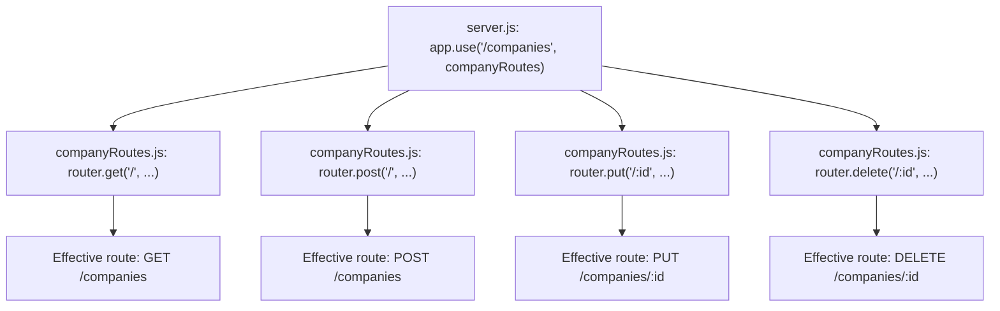

# Phase 3 — REST API / CRUD

## Narration
With Express running and Postgres wired up, this phase built the actual product surface: full CRUD on `companies`. We used `express.Router()` to keep routes separate from `server.js`, wrote parameterized queries (never string-concatenated SQL), and added input validation with a fixed set of valid pipeline stages. By the end of this phase, `GET/POST/PUT/DELETE /companies` were all working and tested in Postman. Next: Phase 4, where we add real-time WebSocket broadcasting on top of this CRUD layer.

## Navigation
- [Express Router](#express-router)
- [GET /companies](#get-companies)
- [POST /companies — Parameterized Queries](#post-companies--parameterized-queries)
- [PUT /companies/:id — params vs body](#put-companiesid--params-vs-body)
- [DELETE /companies/:id](#delete-companiesid)
- [Input Validation](#input-validation)
- [Key Points to Remember](#key-points-to-remember)
- [Docs to Reference](#docs-to-reference)
- [Phase Summary](#phase-summary)

---

## Express Router

`express.Router()` is a mini, mountable Express app — it groups related routes into their own file instead of dumping everything into `server.js`.

```js
const router = express.Router();
router.get('/', getCompanies);
module.exports = router;
```

Mounted in `server.js`:
```js
app.use('/companies', companyRoutes);
```

This means `router.get('/', ...)` inside the file becomes `GET /companies` from the outside — and `router.get('/:id', ...)` would become `GET /companies/:id`.

**Mental model (Spring Boot comparison):** exactly like `@RequestMapping("/companies")` at the class level, with `@GetMapping` methods underneath relative to that base path.



### Interview Explanation
> "I used Express's Router to group all company-related routes into their own file, then mounted that router at `/companies` in the main server file. This means every route inside is automatically prefixed — `router.get('/')` becomes `GET /companies` from the outside. It's the same idea as `@RequestMapping` at the class level in a Spring controller."

## GET /companies

```js
const getCompanies = async (req, res) => {
  const result = await query('SELECT * FROM companies ORDER BY updated_at DESC');
  res.json(result.rows);
};
```

Straightforward read, ordered by most recently updated first.

## POST /companies — Parameterized Queries

```js
const result = await query(
  `INSERT INTO companies (name, sector, stage, metric_value)
   VALUES ($1, $2, $3, $4) RETURNING *`,
  [name, sector, stage, metric_value]
);
```

**`$1, $2, $3, $4` — the critical security pattern.** `pg` sends the query text and the values *separately* to Postgres — user input is never string-concatenated into the SQL itself. Even if `name` contained `'; DROP TABLE companies; --`, it's treated as a literal string value, never executable SQL.

**Mental model (Java comparison):** same defense as `PreparedStatement` in JDBC, or `?` placeholders in Spring's `JdbcTemplate`.

### Interview Explanation
> "Every query in this project uses parameterized placeholders — `$1, $2` etc. — never string concatenation of user input into SQL. This is the standard defense against SQL injection: the query structure and the actual values are sent to Postgres separately, so user input can never be interpreted as executable SQL, no matter what characters it contains."

## PUT /companies/:id — params vs body

```js
const updateCompany = async (req, res) => {
  const { id } = req.params;       // from the URL path
  const { name, sector, stage, metric_value } = req.body;  // from the JSON payload

  const result = await query(
    `UPDATE companies SET name=$1, sector=$2, stage=$3, metric_value=$4, updated_at=NOW()
     WHERE id=$5 RETURNING *`,
    [name, sector, stage, metric_value, id]
  );

  if (result.rows.length === 0) {
    return res.status(404).json({ error: 'Company not found' });
  }
  res.json(result.rows[0]);
};
```

**Key distinction:** `:id` in the route path is accessible via `req.params.id`, never `req.body`. This is the same distinction as `@PathVariable` vs `@RequestBody` in Spring.

**Important gotcha:** if no row matches the `id`, Postgres just returns an empty result — it doesn't throw an error. You must explicitly check `result.rows.length === 0` and return `404` yourself; Express won't infer "not found" from an empty array.

### Interview Explanation
> "`req.params` gives you values from the URL path itself, like the `:id` in `/companies/:id` — while `req.body` is strictly the JSON payload. They're separate mechanisms, similar to `@PathVariable` vs `@RequestBody` in Spring. I also explicitly check for zero rows returned on update/delete, since Postgres doesn't throw an error for 'no matching row' — it just returns an empty result set, so a 404 has to be handled manually."

## DELETE /companies/:id

```js
const result = await query('DELETE FROM companies WHERE id = $1 RETURNING *', [id]);
if (result.rows.length === 0) {
  return res.status(404).json({ error: 'Company not found' });
}
res.json({ message: 'Company deleted', company: result.rows[0] });
```

Same `RETURNING *` pattern — even on delete, Postgres hands back the row that was just removed, useful for confirming what was deleted (or building an "undo" feature later).

## Input Validation

```js
const VALID_STAGES = ['In Review', 'Due Diligence', 'Invested', 'Passed'];

const validateCompanyInput = (data) => {
  const { name, stage, metric_value } = data;
  if (!name || typeof name !== 'string' || name.trim() === '') {
    return 'Company name is required';
  }
  if (stage && !VALID_STAGES.includes(stage)) {
    return `Stage must be one of: ${VALID_STAGES.join(', ')}`;
  }
  if (metric_value !== undefined && (isNaN(metric_value) || metric_value < 0)) {
    return 'metric_value must be a non-negative number';
  }
  return null;
};
```

A fixed `VALID_STAGES` list mirrors what an `enum` would do in a Spring/JPA model — it stops garbage/typo data ("maybe", "idk") from ever reaching the database, and reflects the real pipeline-stage domain concept (Review → Due Diligence → Invested).

### Interview Explanation
> "Rather than letting any string through for the `stage` field, I validate it against a fixed set of allowed values before it ever reaches the database — the same intent as an `enum` constraint in a relational schema or JPA entity, just enforced at the application layer here instead of the database layer."

## Key Points to Remember
- Always use parameterized queries (`$1, $2...`) — never string-concatenate user input into SQL.
- `req.params` = URL path values; `req.body` = JSON payload. Different mechanisms, don't confuse them.
- An empty result set from UPDATE/DELETE is not an error to Postgres — you must check `rows.length === 0` yourself and return the appropriate status.
- `RETURNING *` saves a round trip and is genuinely useful, not just convenient.

## Docs to Reference
- [Express Router official docs](https://expressjs.com/en/4x/api.html#router)
- [OWASP SQL Injection Prevention Cheat Sheet](https://cheatsheetseries.owasp.org/cheatsheets/SQL_Injection_Prevention_Cheat_Sheet.html)
- [node-postgres parameterized queries](https://node-postgres.com/features/queries#parameterized-query)

---

## Phase Summary
Phase 3 delivered the full CRUD REST API for companies: routing via `express.Router()`, safe parameterized SQL throughout, correct handling of not-found cases, and a validation layer enforcing a fixed set of pipeline stages. This is the core data layer everything else in the project (real-time updates, search/pagination, auth) builds on top of.

**Next: Phase 4 — WebSockets / Socket.io.**
