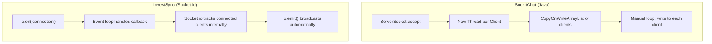
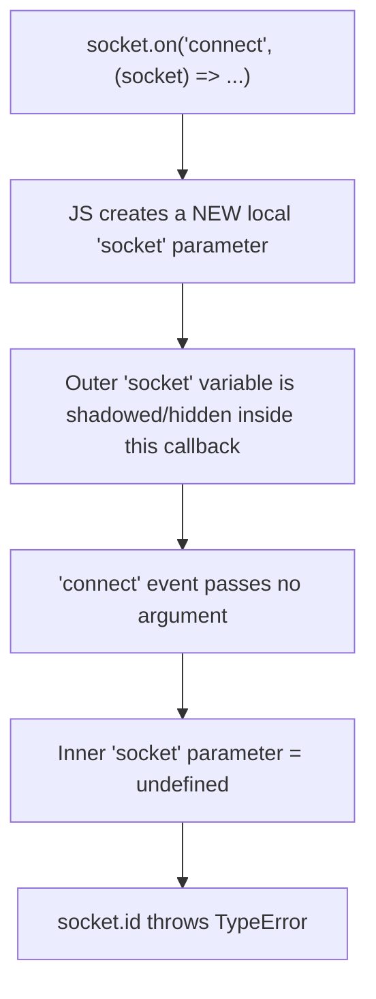

# Phase 4 — WebSockets / Socket.io

## Narration
This is the phase the whole project idea was built around — the JD explicitly asks for socket-handling experience, and you already had that from SockItChat (raw Java sockets, multithreading). Here we mapped that exact experience onto Socket.io: attaching it to the Express HTTP server, testing the connection with a throwaway client script (which hit a real shadowed-variable bug we debugged), then wiring `io.emit()` broadcasts into the CRUD handlers so every create/update/delete pushes live to all connected clients. Next: Phase 5, where we start the Angular frontend that will consume both the REST API and these socket events.

## Navigation
- [The Java Sockets → Socket.io Analogy](#the-java-sockets--socketio-analogy)
- [Attaching Socket.io to Express](#attaching-socketio-to-express)
- [Testing the Connection](#testing-the-connection)
- [Debugging Story: The Shadowed Variable Bug](#debugging-story-the-shadowed-variable-bug)
- [Broadcasting on Data Change](#broadcasting-on-data-change)
- [Key Points to Remember](#key-points-to-remember)
- [Docs to Reference](#docs-to-reference)
- [Phase Summary](#phase-summary)

---

## The Java Sockets → Socket.io Analogy

This table is your single strongest interview talking point in the entire project:

| Java Sockets (SockItChat) | Socket.io (Node) |
|---|---|
| `ServerSocket.accept()` per client | `io.on('connection', socket => ...)` |
| `ExecutorService` thread pool per client | Node's single-threaded event loop handles it via callbacks |
| Manual broadcast loop over `CopyOnWriteArrayList` of clients | `io.emit()` broadcasts to all connected sockets automatically |
| `DataOutputStream.write()` | `socket.emit('eventName', data)` |
| Custom binary protocol you designed | Socket.io handles framing for you — you just emit named events |



### Interview Explanation
> "In my Java chat app, a new client connection meant spinning up a dedicated thread, and broadcasting meant manually looping over a thread-safe list of connected clients to write to each one. In Socket.io, the same fundamental goal — react to events on a persistent connection and broadcast to everyone — is handled differently: there's no thread per client, just a callback registered on the event loop, and Socket.io tracks connected clients internally so `io.emit()` broadcasts to everyone with zero manual bookkeeping. Different execution model, same core problem being solved."

## Attaching Socket.io to Express

Socket.io doesn't attach to the Express `app` directly — it attaches to the underlying raw HTTP server:

```js
const http = require('http');
const { Server } = require('socket.io');

const app = express();
const server = http.createServer(app);
const io = new Server(server, { cors: { origin: '*' } });

io.on('connection', (socket) => {
  console.log('Client connected:', socket.id);
  socket.on('disconnect', () => {
    console.log('Client disconnected:', socket.id);
  });
});

server.listen(PORT, () => { /* ... */ });  // note: server.listen, not app.listen
```

- `http.createServer(app)` — creates the raw HTTP server object with Express as its request handler. Closest Java equivalent: your `ServerSocket`.
- `new Server(server, {...})` — Socket.io attaches to that same server, upgrading eligible connections to WebSocket.
- `io.on('connection', socket => {...})` — fires once **per client**, giving a `socket` object for that one client. Your `ExecutorService.submit(new ClientHandler(...))` moment.
- `socket.on('disconnect', ...)` — cleanup logic per client, equivalent to removing a client from your `CopyOnWriteArrayList` in SockItChat.

### Interview Explanation
> "Socket.io needs to attach to the raw HTTP server, not directly to Express, because it has to intercept the HTTP upgrade request that turns a normal HTTP connection into a persistent WebSocket connection. So I explicitly created the HTTP server with `http.createServer(app)`, then attached Socket.io to that same server object — Express keeps handling normal REST requests, Socket.io handles the WebSocket upgrade, both sharing one underlying server."

## Testing the Connection

Before wiring real broadcast logic, we proved the raw connection worked with a throwaway `test-client.js` using `socket.io-client` — confirming connect/disconnect events logged correctly on both sides before building anything on top of it. Same instinct as the `/test-db` route in Phase 2: **prove infrastructure works before building features on it.**

## Debugging Story: The Shadowed Variable Bug

This is a genuinely good "tell me about a bug you debugged" story.

**Symptom:** `TypeError: Cannot read properties of undefined (reading 'id')` when running the test client.

**The actual code:**
```js
socket.on("connect", (socket) => {   // BUG: parameter named `socket` shadows outer `socket`
    console.log("Connected to server as: ", socket.id);
});
```

**Root cause:** the `'connect'` event doesn't pass any argument to its callback — there's nothing to connect. Naming the callback parameter `socket` created a **new local variable** that shadowed the outer `socket` variable, silently, with no compiler warning. That inner `socket` was `undefined`, so `.id` on it threw.

**Fix:**
```js
socket.on("connect", () => {   // no parameter — use the outer `socket` variable directly
    console.log("Connected to server as:", socket.id);
});
```



### Interview Explanation
> "I hit a `TypeError: Cannot read properties of undefined` on a socket connection callback. The root cause was variable shadowing — I'd named a callback parameter `socket`, the same as an outer variable already in scope. JavaScript let this happen silently, no compiler warning, unlike Java where you'd typically get a warning or error for this kind of shadowing. Since the `'connect'` event doesn't actually pass an argument, that inner `socket` parameter was `undefined`, and calling `.id` on it threw. The fix was simply not declaring a parameter I didn't need, and relying on the outer variable via closure instead. It reinforced a rule I now follow: name callback parameters after what the event actually provides, never reuse an outer variable's name unless deliberately shadowing."

## Broadcasting on Data Change

Passing `io` into the routes/controllers (a manual dependency-injection pattern):

```js
// companyRoutes.js
module.exports = (io) => {
  router.post('/', (req, res) => companyController.createCompany(req, res, io));
  return router;
};

// server.js
app.use('/companies', companyRoutes(io));
```

Then in the controller, after a successful DB write:
```js
const company = result.rows[0];
io.emit('companyCreated', company);
res.status(201).json(company);
```

`io.emit()` broadcasts to **every currently connected socket**, unconditionally — the direct equivalent of the manual loop over `CopyOnWriteArrayList` in SockItChat, just handled internally by Socket.io.

### Interview Explanation
> "I passed the `io` instance into my route/controller layer as a form of manual dependency injection, so that after any successful database write — create, update, or delete — the controller can immediately broadcast that change to every connected client via `io.emit()`. This is what makes the dashboard update live across multiple browser tabs without polling or refreshing."

## Key Points to Remember
- Socket.io attaches to the raw HTTP server, not the Express `app` — use `server.listen()`, not `app.listen()`, once Socket.io is involved.
- Always test raw infrastructure (a socket connection, a DB connection) with a minimal script before building real features on it.
- Never name a callback parameter the same as an outer variable unless you deliberately mean to shadow it — JS won't warn you.
- `io.emit()` = broadcast to everyone. There's also `socket.emit()` (to one client) and `socket.broadcast.emit()` (to everyone except the sender) — we used `io.emit()` since every client, including the sender, should see the update.

## Docs to Reference
- [Socket.io official docs](https://socket.io/docs/v4/)
- [Socket.io server API reference](https://socket.io/docs/v4/server-api/)
- [MDN — JavaScript variable scope and shadowing](https://developer.mozilla.org/en-US/docs/Glossary/Shadowing)

---

## Phase Summary
Phase 4 built the real-time layer: attaching Socket.io to the raw HTTP server, proving the connection with a test client (and debugging a real shadowing bug along the way), then wiring `io.emit()` broadcasts into every CRUD operation so all connected clients receive live updates. This phase directly satisfies the JD's socket-handling requirement and gives you the strongest analogy-driven talking point in the whole project.

**Next: Phase 5 — Angular Fundamentals & Frontend Scaffold.**
