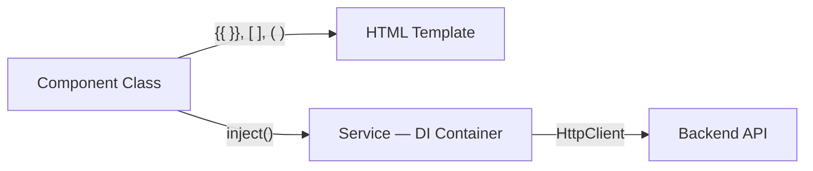

# Phase 5 — Angular Fundamentals & Frontend Scaffold

## Narration
With the backend fully functional (CRUD + sockets), this phase started the Angular frontend from scratch — a separate repo, `investsync-frontend`. We covered the three pillars Angular is built on (components, data binding, services/DI), wired up `HttpClient` to actually call the Express API, and built a company list + creation form. We also hit and fixed a real Angular 21 naming-convention issue (`.ts` files instead of `.component.ts`) and a stale-build-cache compiler error. Next: Phase 6, where we connect this frontend to the Socket.io backend for live updates — and hit the project's hardest bug.

## Navigation
- [Angular's Three Core Concepts](#angulars-three-core-concepts)
- [Enabling HttpClient](#enabling-httpclient)
- [CompanyService — Observables](#companyservice--observables)
- [DashboardComponent — Lifecycle Hooks](#dashboardcomponent--lifecycle-hooks)
- [Angular 21's Control Flow (`@if`/`@for`)](#angular-21s-control-flow-iffor)
- [Two-Way Binding — the Creation Form](#two-way-binding--the-creation-form)
- [Debugging Story: NG2012 and Stale Build Cache](#debugging-story-ng2012-and-stale-build-cache)
- [Key Points to Remember](#key-points-to-remember)
- [Docs to Reference](#docs-to-reference)
- [Phase Summary](#phase-summary)

---

## Angular's Three Core Concepts

**1. Components** — a TypeScript class (logic/data) + HTML template (view) + CSS (style), bundled together. Comparable to a Swing custom `JPanel` subclass owning its own state, except Angular's rendering is declarative HTML with data binding, not imperative `paintComponent()` calls.

**2. Data Binding** — three syntaxes:
| Syntax | Direction | Example |
|---|---|---|
| `{{ expr }}` | One-way, class → HTML text | `{{ company.name }}` |
| `[property]="value"` | One-way, class → HTML property | `[disabled]="isLoading"` |
| `(event)="handler()"` | One-way, HTML → class | `(click)="deleteCompany(id)"` |
| `[(ngModel)]="value"` | Two-way (combines the above two) | form inputs |

**3. Services + Dependency Injection** — a plain class holding shared logic/data (like HTTP calls), injected via Angular's DI container. Directly maps to Spring's `@Autowired`/constructor injection — declare what you need, the framework provides it.



### Interview Explanation
> "Angular components bundle a TypeScript class, an HTML template, and CSS into one reusable UI unit. Data flows between the class and template via binding — interpolation for text, property binding for one-way class-to-DOM, event binding for DOM-to-class. Shared logic like API calls lives in services, injected via Angular's dependency injection container — conceptually identical to `@Autowired` in Spring, just resolved via a function call (`inject()`) rather than an annotation in newer Angular versions."

## Enabling HttpClient

In `app.config.ts` (the modern replacement for a root `NgModule`):
```ts
export const appConfig: ApplicationConfig = {
  providers: [provideRouter(routes), provideHttpClient()],
};
```

`ApplicationConfig` is where app-wide providers are registered — the equivalent of registering a `RestTemplate`/`WebClient` bean in a Spring config class.

## CompanyService — Observables

```ts
@Injectable({ providedIn: 'root' })
export class CompanyService {
  private http = inject(HttpClient);
  private baseUrl = 'http://localhost:3000/companies';

  getCompanies(): Observable<Company[]> {
    return this.http.get<Company[]>(this.baseUrl);
  }
}
```

- **`@Injectable({ providedIn: 'root' })`** — marks the class as injectable app-wide, as a singleton. Same as a Spring `@Service` bean, default scope.
- **`inject(HttpClient)`** — modern DI syntax (function call, replacing constructor injection in many cases, though both still work).
- **`Observable<Company[]>`** — the key new concept. `HttpClient.get()` returns an Observable, not a Promise — a stream that can emit values over time. For a plain HTTP GET it emits once then completes (functionally like a Promise here), but the *same* Observable primitive is reused later for the continuous stream of WebSocket events — this is why Angular standardizes on Observables everywhere.

### Interview Explanation
> "Angular's `HttpClient` returns Observables, not Promises. For a one-shot HTTP call, an Observable behaves similarly to a Promise — it emits once and completes. But Observables can emit multiple times over their lifetime, which is exactly what's needed later for WebSocket event streams. Using one consistent primitive (Observable) for both one-shot HTTP calls and ongoing event streams is a deliberate design choice in Angular's architecture."

## DashboardComponent — Lifecycle Hooks

```ts
export class DashboardComponent implements OnInit {
  private companyService = inject(CompanyService);
  companies: Company[] = [];

  ngOnInit(): void {
    this.companyService.getCompanies().subscribe({
      next: (data) => { this.companies = data; },
      error: (err) => console.error('Failed to load companies', err)
    });
  }
}
```

- **`ngOnInit()`** — a lifecycle hook Angular calls automatically right after the component is created and DI has resolved. Equivalent to `@PostConstruct` in Spring.
- **`.subscribe({...})`** — this is how an Observable actually "runs." Observables are **lazy** — nothing happens until something subscribes. `next` fires on successful data, `error` fires on failure.

## Angular 21's Control Flow (`@if`/`@for`)

Angular 21 replaced the older `*ngIf`/`*ngFor` structural directives with block syntax:

```html
@if (companies.length === 0) {
  <p>No companies yet.</p>
} @else {
  @for (company of companies; track company.id) {
    <tr><td>{{ company.name }}</td></tr>
  }
}
```

**`track` is mandatory** in `@for` (unlike the old optional `trackBy`). It tells Angular's change detection how to uniquely identify each item across re-renders, so it can reuse existing DOM elements instead of tearing down and rebuilding the whole list on every change. Always track by a stable unique field (`company.id`), never array index.

### Interview Explanation
> "Angular 21 introduced a new built-in control-flow syntax — `@if`/`@for`/`@else` — replacing the older `*ngIf`/`*ngFor` structural directives. It reads more like plain TypeScript, and `@for` now requires an explicit `track` expression, which tells Angular how to identify each item uniquely across re-renders so it can efficiently reuse DOM nodes instead of rebuilding the whole list every time the underlying data changes."

## Two-Way Binding — the Creation Form

`FormsModule`'s `[(ngModel)]` is "banana-in-a-box" — shorthand for `[ngModel]` (class → input) plus `(ngModelChange)` (input → class), keeping both directions in sync automatically.

```html
<input type="text" [(ngModel)]="newCompany.name" name="name" required />
```

**Gotcha:** every `[(ngModel)]` input inside a `<form>` needs a `name` attribute — `FormsModule` uses it internally to register the control, even though you never read `name` directly in TypeScript. Missing it causes a runtime error.

### Interview Explanation
> "`[(ngModel)]` is Angular's two-way binding syntax for forms — it's shorthand combining a one-way property binding and a one-way event binding into a single directive, so a form field and a class property stay in sync in both directions. One easy-to-miss requirement: every `ngModel`-bound field inside a `<form>` needs a `name` attribute for Angular's `FormsModule` to register it correctly."

## Debugging Story: NG2012 and Stale Build Cache

**Error:** `NG2012: Component imports must be standalone components, directives, pipes, or must be NgModules.`

**What looked wrong but wasn't:** class names, imports, and file paths were all actually correct.

**Root cause:** Angular's incremental compiler cache (`.angular/cache`) had gotten into a broken state after several rapid file renames/edits — a misleading downstream symptom, not a real code error.

**Fix:**
```bash
rm -rf .angular/cache
ng serve
```

**Separately, a real (not cache-related) naming issue:** Angular 21's CLI dropped the `.component.ts` file suffix convention by default — `ng generate component dashboard` now produces `dashboard.ts` (class `DashboardComponent`), not `dashboard.component.ts`. Imports need to reference the actual generated filenames, not older-convention assumed ones.

### Interview Explanation
> "I hit a confusing Angular compiler error that looked like a real import/naming mismatch, but turned out to be a stale incremental build cache after several rapid file edits — clearing `.angular/cache` and restarting resolved it immediately. It taught me that in Angular's build tooling, a misleading compiler error is sometimes a caching artifact, not a real code issue — worth ruling out early rather than deep-diving into code that's actually fine."

## Key Points to Remember
- Angular 21 is standalone-only by default — no `NgModule`s; components declare their own `imports`.
- Angular 21 CLI generates files without the `.component.ts`/`.service.ts` suffix — filenames are just `dashboard.ts`, `company.ts`, etc. (class names are unchanged).
- Observables are lazy — nothing runs until `.subscribe()` is called.
- `track` in `@for` is mandatory in modern Angular and should always be a stable unique identifier.
- When Angular's compiler throws a confusing/inconsistent error after several edits, try clearing `.angular/cache` before deep-diving.

## Docs to Reference
- [Angular official docs — Components](https://angular.dev/guide/components)
- [Angular official docs — Control flow (`@if`/`@for`)](https://angular.dev/guide/templates/control-flow)
- [Angular official docs — Dependency Injection](https://angular.dev/guide/di)
- [RxJS Observables guide](https://rxjs.dev/guide/observable)

---

## Phase Summary
Phase 5 stood up the Angular frontend: core concepts (components, binding, services/DI), `HttpClient` + Observables for talking to the Express API, a company list rendered with Angular 21's new control-flow syntax, a creation form using two-way binding, and two real debugging stories (a stale build cache, and Angular 21's changed file-naming convention). By the end, the dashboard displayed live data from Postgres through Express into Angular, with a working creation form.

**Next: Phase 6 — Real-Time Integration + Zoneless Debugging.**
