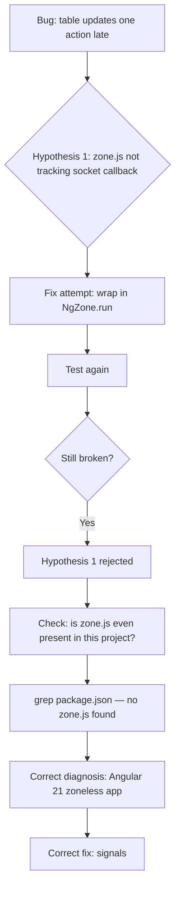

# Phase 6 — Real-Time Integration + Zoneless Debugging

## Narration
This is the demo moment the whole project was built toward: two browser tabs, one update, both update instantly with no refresh. We wired `socket.io-client` into Angular via a `SocketService`, wrapping Socket.io's callback API in Observables. It didn't work on the first try — the update only appeared after some unrelated action (typing in a field). This phase documents the full debugging journey: wrong hypothesis first (NgZone), then the real diagnosis (Angular 21 is zoneless by default), and the correct fix (signals). This is your best "tell me about a bug you debugged" story in the entire project. Next: Phase 7, where we add search/filter/pagination and a second entity (activity log).

## Navigation
- [Building the SocketService](#building-the-socketservice)
- [Wiring It Into the Dashboard](#wiring-it-into-the-dashboard)
- [The Bug: Updates Only Appear on Next Action](#the-bug-updates-only-appear-on-next-action)
- [Wrong Hypothesis: NgZone](#wrong-hypothesis-ngzone)
- [Correct Diagnosis: Zoneless Angular 21](#correct-diagnosis-zoneless-angular-21)
- [The Real Fix: Signals](#the-real-fix-signals)
- [Full Debugging Timeline](#full-debugging-timeline)
- [Key Points to Remember](#key-points-to-remember)
- [Docs to Reference](#docs-to-reference)
- [Phase Summary](#phase-summary)

---

## Building the SocketService

```ts
@Injectable({ providedIn: 'root' })
export class SocketService implements OnDestroy {
  private socket: Socket = io('http://localhost:3000');

  onCompanyCreated(): Observable<Company> {
    return new Observable((observer) => {
      this.socket.on('companyCreated', (data: Company) => observer.next(data));
    });
  }

  ngOnDestroy(): void {
    this.socket.disconnect();
  }
}
```

**`new Observable((observer) => {...})`** — this is the first time *creating* an Observable manually (rather than just consuming one from `HttpClient`). It wraps Socket.io's callback-based API into Angular's Observable stream. `observer.next(data)` fires every time the socket event fires — and unlike an HTTP GET (which emits once), this can emit many times over the connection's life.

**Mental model (Java/SockItChat comparison):** in Java, a `ClientHandler` thread blocked on `DataInputStream.read()` and handled messages inline. Here, `socket.on(event, callback)` registers a callback the event loop invokes whenever that event arrives — no blocking, no thread, just an async callback.

## Wiring It Into the Dashboard

```ts
ngOnInit(): void {
  this.loadCompanies();
  this.socketService.onCompanyCreated().subscribe((company) => {
    this.companies = [company, ...this.companies];
  });
}
```

`[company, ...this.companies]` instead of `.push()` — Angular's change detection generally responds more reliably to **new array references** than in-place mutation. This detail turned out to matter a lot once the real bug surfaced.

## The Bug: Updates Only Appear on Next Action

**Test:** two browser tabs open. Submit the form in Tab A. Expected: Tab B's table updates instantly. **Actual:** Tab B's table only updated the *next* time you did something in Tab B (like typing in an input) — not immediately when the socket event arrived.

## Wrong Hypothesis: NgZone

**First theory:** Socket.io's callback runs *outside Angular's zone* — `zone.js` patches common async APIs (`setTimeout`, DOM events, HTTP) to auto-detect "something happened, re-render now," but third-party libraries like Socket.io's internal transport aren't reliably patched. So the fix attempted was:

```ts
this.socket.on('companyCreated', (data: Company) => {
  this.ngZone.run(() => observer.next(data));
});
```

**Result: no change.** This ruled something out — a genuinely useful negative result.



## Correct Diagnosis: Zoneless Angular 21

Checking `package.json` and `main.ts` confirmed: **no `zone.js` dependency at all.** Angular 21 defaults new projects to **zoneless** mode. This fully explained why `NgZone.run()` did nothing — there was no zone to run in; `NgZone` methods are effectively no-ops in a zoneless app.

In zoneless mode, change detection isn't automatic at all. It only runs when Angular's own reactive primitives change: signals, the `async` pipe, or component inputs. Plain property mutation (`this.companies = [...]`) from a raw external callback does nothing to trigger a repaint, regardless of zone wrapping.

### Interview Explanation
> "The bug looked at first like a classic zone.js problem — third-party async callbacks not being tracked for change detection — so I tried wrapping the update in `NgZone.run()`. That had zero effect, which was actually informative: it meant there was no zone.js at all. Checking `package.json` confirmed it — this was a zoneless Angular 21 app, the new default for fresh projects. In zoneless mode, change detection only runs off explicit reactive primitives like signals, not automatic zone-patched async tracking. That reframed the fix entirely."

## The Real Fix: Signals

```ts
companies = signal<Company[]>([]);

// reading in the template: companies()
// updating: 
this.companies.update(current => [company, ...current]);
```

A `signal<T>()` is a reactive container. Reading it inside a template (`companies()`) registers that template as dependent on the signal. Calling `.set()`/`.update()` directly notifies Angular's reactivity graph to re-render exactly what depends on it — a precise, push-based model, not a "patch everything and guess" approach.



```mermaid
flowchart LR
    A["companies.update(fn)"] --> B[Signal's internal value changes]
    B --> C[Reactivity graph notified]
    C --> D["Only template expressions reading companies&#40;&#41; re-render"]
```

The same fix had to be applied to the **form reset** bug too — `newCompany` also needed to become a signal for the input fields to visually clear after submit, for the identical underlying reason.

### Interview Explanation
> "The correct fix was converting the plain array property into an Angular signal. Signals are Angular 21's native reactivity primitive, specifically designed to work without zone.js — reading a signal in a template subscribes that template to future changes, and calling `.update()` or `.set()` on it directly and precisely triggers re-rendering wherever it's used. This isn't a workaround — it's actually the more current, idiomatic pattern in modern Angular, so adopting it here aligned the code with where the framework is heading anyway."

## Full Debugging Timeline

1. Two-tab test fails — update only shows on next unrelated action.
2. Added `console.log` inside the socket subscription to confirm data *was* arriving correctly and immediately — it was. This isolated the bug to **rendering**, not data flow.
3. Hypothesis 1: zone.js not tracking the callback → tried `NgZone.run()` → no change.
4. Checked `package.json`/`main.ts` → confirmed no `zone.js` anywhere → zoneless app confirmed.
5. Converted `companies` (and later `newCompany`) to signals, updated the template to call them as functions (`companies()`).
6. Retested — instant updates across both tabs, no interaction needed.

### Interview Explanation (full story, STAR-style)
> "**Situation:** I built real-time updates using Socket.io and Angular, but the UI only reflected new data after some unrelated user action, not immediately when the event arrived. **Task:** diagnose why the data update wasn't reflected in the DOM instantly. **Action:** I first confirmed via console logging that the data itself was updating correctly and immediately — so this was a rendering problem, not a data problem. I hypothesized it was a zone.js tracking issue with third-party async callbacks and tried wrapping the update in `NgZone.run()` — that had no effect, which told me something more fundamental was going on. Checking the project's dependencies confirmed there was no zone.js at all — this was a zoneless Angular 21 app, where change detection only responds to signals, not automatic zone-based tracking. **Result:** I converted the relevant state to Angular signals, which are the framework's native reactivity primitive for zoneless apps, and the live updates worked instantly and correctly."

## Key Points to Remember
- A "no effect" result from a fix attempt is still useful information — it rules out a hypothesis and should redirect your investigation, not just be abandoned silently.
- Always confirm *where* a bug actually lives (data vs. rendering vs. network) before attempting a fix — a `console.log` at the right point turned "mysterious UI bug" into "confirmed rendering-only issue" in one step.
- Angular 21 defaults to zoneless — check `package.json` for `zone.js` early if you ever see automatic-change-detection assumptions failing.
- Signals are read as function calls in templates (`companies()`), not as plain properties, once a property becomes a signal.

## Docs to Reference
- [Angular official docs — Signals](https://angular.dev/guide/signals)
- [Angular official docs — Zoneless change detection](https://angular.dev/guide/zoneless)
- [Angular official docs — NgZone](https://angular.dev/api/core/NgZone)

---

## Phase Summary
Phase 6 delivered the project's core real-time feature and its hardest debugging challenge. We built a `SocketService` wrapping Socket.io in Observables, wired it into the dashboard, hit a genuine change-detection bug, ruled out an incorrect hypothesis (NgZone), correctly diagnosed the root cause (zoneless Angular 21), and fixed it properly using signals — Angular's native reactivity primitive. This is the strongest debugging narrative in the whole project and worth rehearsing verbatim before an interview.

**Next: Phase 7 — Feature Expansion (Search/Filter/Pagination + Activity Log).**
