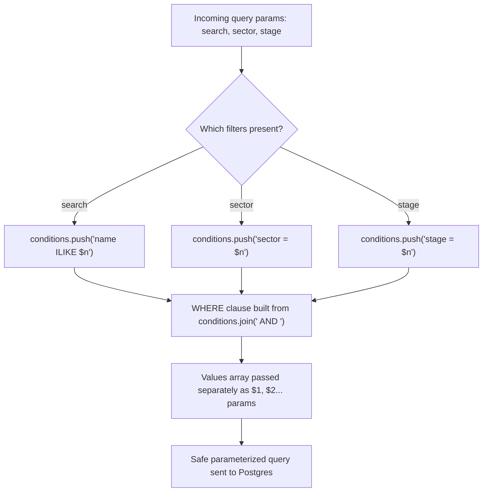
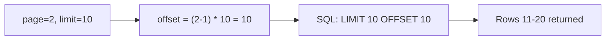

# Phase 7 — Feature Expansion: Search/Filter/Pagination + Activity Log

## Narration
With CRUD and real-time updates working, this phase tackled two real production concerns: you can't return an entire table to the client forever (scalability), and a PE/VC-style tool needs an audit trail of who changed what (auditability). We rebuilt `GET /companies` to support search/filter/pagination safely, and added a second relational entity — `activity_log` — that records every mutation and streams live to a "Recent Activity" feed. Next: Phase 8, where we secure all of this with JWT auth, centralized error handling, and rate limiting.

## Navigation
- [Why This Phase Matters](#why-this-phase-matters)
- [Dynamic WHERE Clause — Safely](#dynamic-where-clause--safely)
- [Pagination Math](#pagination-math)
- [Frontend: HttpParams](#frontend-httpparams)
- [Second Entity: activity_log](#second-entity-activity_log)
- [Wiring Logging Into Existing CRUD](#wiring-logging-into-existing-crud)
- [Live Activity Feed](#live-activity-feed)
- [A Design Tradeoff We Made](#a-design-tradeoff-we-made)
- [Key Points to Remember](#key-points-to-remember)
- [Docs to Reference](#docs-to-reference)
- [Phase Summary](#phase-summary)

---

## Why This Phase Matters

Returning the entire `companies` table on every `GET` request is fine at 5 rows, catastrophic at 50,000 — no production API does this. Similarly, in a decision-support tool for PE/VC (Kelp's actual domain), "who changed the stage of this deal, and when" is often more important than the current value itself.

## Dynamic WHERE Clause — Safely

```js
const conditions = [];
const values = [];
let idx = 1;

if (search) {
  conditions.push(`name ILIKE $${idx++}`);
  values.push(`%${search}%`);
}
if (stage) {
  conditions.push(`stage = $${idx++}`);
  values.push(stage);
}

const whereClause = conditions.length ? `WHERE ${conditions.join(' AND ')}` : '';
```

**The critical safety rule:** column names (`name`, `stage`) are always hardcoded by the developer, never derived from user input — only the *values* going into the `$1, $2...` placeholders come from user input. This is what keeps a dynamically-built query injection-safe despite the query text itself changing based on which filters are present.

**`ILIKE` vs `=`:** case-insensitive `LIKE`, Postgres-specific — lets `"acme"` match `"Acme Corp"`. Standard for search-box UX.



### Interview Explanation
> "I built the WHERE clause dynamically based on which filters were actually provided — but the column names in that clause are always hardcoded strings I wrote, never derived from user input. Only the *values* being filtered on go through parameterized placeholders. That distinction is what keeps a dynamically-constructed query safe from SQL injection — the shape of the query can vary, but user input never touches the SQL text itself."

## Pagination Math

```js
const offset = (Number(page) - 1) * Number(limit);

const dataResult = await query(
  `SELECT * FROM companies ${whereClause} ORDER BY updated_at DESC LIMIT $${idx} OFFSET $${idx+1}`,
  [...values, limit, offset]
);

const countResult = await query(
  `SELECT COUNT(*)::int as total FROM companies ${whereClause}`,
  values
);
```

**Why a separate `COUNT(*)` query is required:** the data query is capped by `LIMIT`, so `dataResult.rows.length` only ever tells you how many rows came back *on this page* — never the true total across all pages. The count query runs the same filters, without the limit/offset, specifically to get that total.



### Interview Explanation
> "Pagination requires two separate queries against the same filters: one with `LIMIT`/`OFFSET` to get the actual page of data, and one with `COUNT(*)` — no limit — to get the true total row count needed to calculate total pages. You can't derive the total from the paginated result set alone, since it's deliberately capped."

## Frontend: HttpParams

```ts
getCompanies(filters: CompanyFilters = {}): Observable<PaginatedCompanies> {
  let params = new HttpParams();
  Object.entries(filters).forEach(([key, value]) => {
    if (value !== undefined && value !== '') {
      params = params.set(key, value.toString());
    }
  });
  return this.http.get<PaginatedCompanies>(this.baseUrl, { params });
}
```

`HttpParams` is Angular's immutable, type-safe way to build query strings. `.set()` returns a **new** `HttpParams` instance each call — the same immutability principle already seen with signals disliking in-place mutation.

## Second Entity: activity_log

```sql
CREATE TABLE activity_log (
  id SERIAL PRIMARY KEY,
  action VARCHAR(20) NOT NULL,
  company_name VARCHAR(100) NOT NULL,
  details TEXT,
  created_at TIMESTAMP DEFAULT NOW()
);
```

A deliberately simple, denormalized log table — it stores `company_name` directly rather than a foreign key to `companies.id`, so a log entry survives even after the company itself is deleted (an audit trail must outlive the thing it's auditing).

### Interview Explanation
> "I added a second table, `activity_log`, specifically to record every create/update/delete action as its own audit trail — separate from the `companies` table itself. I deliberately stored the company name as plain text rather than a foreign key, because an audit log needs to survive even after the referenced company is deleted — you still want to know 'Acme Corp was deleted' after Acme Corp no longer exists in the main table."

## Wiring Logging Into Existing CRUD

```js
const { logActivity } = require('../db/activityLog');

// after a successful create:
io.emit('companyCreated', company);
const logEntry = await logActivity('CREATED', company.name, `Stage: ${company.stage}`);
io.emit('activityLogged', logEntry);
```

Same pattern applied to update and delete, each emitting its own `activityLogged` socket event after writing to the log table.

## Live Activity Feed

Frontend subscribes to `activityLogged` the same way as the other socket events, prepending new entries to a signal-backed array:

```ts
this.socketService.onActivityLogged().subscribe((entry) => {
  this.activity.update((current) => [entry, ...current].slice(0, 20));
});
```

`.slice(0, 20)` caps the in-memory feed at 20 entries client-side, matching the `LIMIT 20` used on the initial fetch — keeps the UI from growing unbounded during a long session.

## A Design Tradeoff We Made

Once pagination/filters existed, socket handlers for `companyCreated`/`Updated`/`Deleted` were changed from **directly splicing the local array** to **re-fetching via `loadCompanies()`** with the current filters/page applied. A newly created company might not even belong on the page/filter view currently being shown — manually inserting it would show data inconsistent with the user's own active filters. Re-fetching is the *correct* behavior here, not a simplification.

### Interview Explanation
> "Once search and pagination existed, I changed how the real-time socket handlers update the UI. Instead of directly splicing a new item into the local array, I re-fetch the current page with the current filters applied. This is deliberate: a newly created company might not belong on the page or match the filter the user is currently viewing, so blindly inserting it would show data inconsistent with what the user actually asked to see."

## Key Points to Remember
- Never let user input become part of the SQL text itself (column/table names) — only ever pass it as a parameterized value.
- Pagination always needs two queries: one for the page of data, one for the total count.
- `HttpParams`/signals are both immutable-by-design in Angular — always reassign (`.set()`, spread), never mutate in place.
- An audit log table should be able to outlive the record it's auditing — avoid hard foreign-key dependencies that would cascade-delete history.

## Docs to Reference
- [PostgreSQL LIKE/ILIKE docs](https://www.postgresql.org/docs/current/functions-matching.html)
- [PostgreSQL LIMIT/OFFSET docs](https://www.postgresql.org/docs/current/queries-limit.html)
- [Angular HttpParams docs](https://angular.dev/api/common/http/HttpParams)

---

## Phase Summary
Phase 7 turned the CRUD API into something production-shaped: safe dynamic filtering, correct pagination with a proper total-count calculation, and a second relational entity (`activity_log`) providing a live, real-time audit trail — directly relevant to Kelp's decision-support domain. We also made a deliberate design call to re-fetch rather than splice on socket events, once filters/pagination made local-array mutation unsafe.

**Next: Phase 8 — Security & Production Hardening.**
