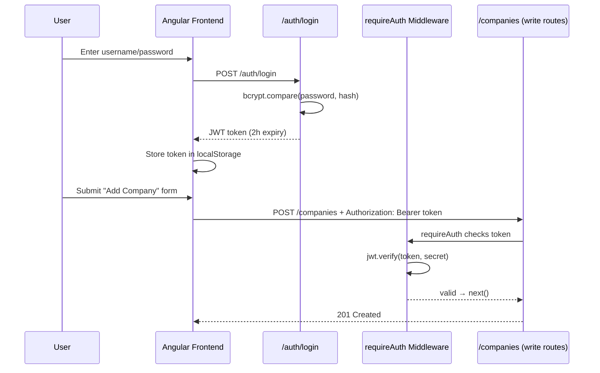
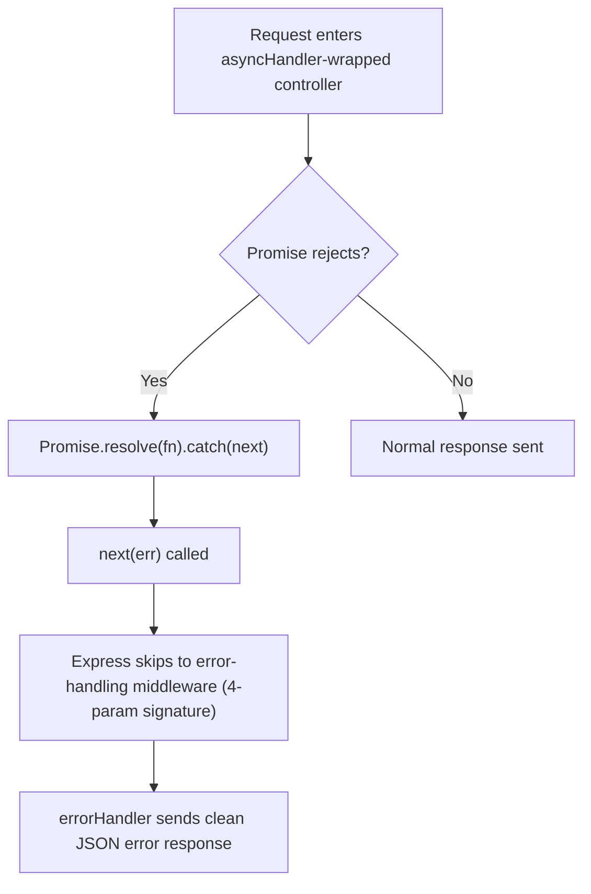
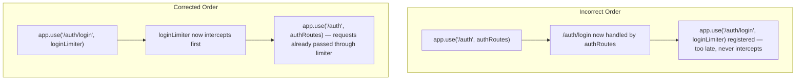

# Phase 8 — Security & Production Hardening

## Narration
This is the final phase — turning a working demo into something that looks and behaves like a production backend. We added JWT authentication (protecting writes, keeping reads public), centralized error handling with an async wrapper (which surfaced and fixed a real double-response bug in `deleteCompany`), and rate limiting (which we initially wired up incorrectly — a real middleware-ordering bug we caught and fixed). By the end of this phase, the project covers auth, error resilience, and abuse protection — genuinely comprehensive for a fresher-level project. This is the last phase; after this, notes shift to interview prep and final resume/README polish (already covered separately).

## Navigation
- [JWT Authentication Flow](#jwt-authentication-flow)
- [Password Hashing with bcrypt](#password-hashing-with-bcrypt)
- [The Auth Middleware](#the-auth-middleware)
- [Frontend: Auth Service + HTTP Interceptor](#frontend-auth-service--http-interceptor)
- [Centralized Error Handling](#centralized-error-handling)
- [Debugging Story: The Double-Response Bug](#debugging-story-the-double-response-bug)
- [Rate Limiting](#rate-limiting)
- [Debugging Story: The Middleware Ordering Bug](#debugging-story-the-middleware-ordering-bug)
- [Key Points to Remember](#key-points-to-remember)
- [Docs to Reference](#docs-to-reference)
- [Phase Summary](#phase-summary)

---

## JWT Authentication Flow

**Scope, deliberately kept lean:** a single admin login (no user registration flow), protecting only `POST`/`PUT`/`DELETE` — `GET` routes stay public since viewing the dashboard doesn't need login.



### Interview Explanation
> "The auth flow is a single admin login: the user submits credentials to `/auth/login`, the server verifies the password against a stored bcrypt hash, and if valid, signs a JWT containing the username with a 2-hour expiry. The frontend stores that token and attaches it to every subsequent write request via an HTTP interceptor. A middleware on the backend verifies the token's signature and expiry before allowing any create/update/delete to proceed — read access stays public since viewing data doesn't require authentication in this design."

## Password Hashing with bcrypt

```js
const isValid = await bcrypt.compare(password, process.env.ADMIN_PASSWORD_HASH);
```

The password hash (generated once via `bcrypt.hashSync('password', 10)`) is stored in `.env`, never the plaintext password. `bcrypt.compare()` re-derives the hash using the same salt embedded in the stored hash and compares — you never manually re-hash and string-compare.

**Mental model (Spring comparison):** same principle as Spring Security's `BCryptPasswordEncoder.matches()`.

### Interview Explanation
> "I never store the plaintext admin password anywhere, including in `.env` — only its bcrypt hash. `bcrypt.compare()` handles extracting the salt embedded in that hash and checking the incoming password against it correctly; you never manually re-hash and do a string comparison, since bcrypt's salting means the same password can produce different hash outputs each time it's hashed."

## The Auth Middleware

```js
const requireAuth = (req, res, next) => {
  const authHeader = req.headers.authorization;
  if (!authHeader || !authHeader.startsWith('Bearer ')) {
    return res.status(401).json({ error: 'No token provided' });
  }
  const token = authHeader.split(' ')[1];
  try {
    req.user = jwt.verify(token, process.env.JWT_SECRET);
    next();
  } catch (err) {
    return res.status(401).json({ error: 'Invalid or expired token' });
  }
};
```

Applied selectively per route:
```js
router.post('/', requireAuth, (req, res) => companyController.createCompany(req, res, io));
```

**Order matters again here** (same principle from Phase 1): `requireAuth` runs *before* the controller, so unauthorized requests never touch the database.

### Interview Explanation
> "`requireAuth` is custom Express middleware — same shape as `express.json()` or `cors()`, but with logic I wrote myself: check for a Bearer token, verify its signature and expiry with `jwt.verify()`, and either call `next()` to proceed or short-circuit with a 401. Because middleware runs before the route handler, an invalid or missing token means the request never reaches the database at all."

## Frontend: Auth Service + HTTP Interceptor

```ts
export const authInterceptor: HttpInterceptorFn = (req, next) => {
  const authService = inject(AuthService);
  const token = authService.token();
  if (token) {
    const cloned = req.clone({ setHeaders: { Authorization: `Bearer ${token}` } });
    return next(cloned);
  }
  return next(req);
};
```

An **interceptor** is a function every outgoing `HttpClient` request passes through — lets you modify requests globally without touching every individual service call. Equivalent to a Spring `OncePerRequestFilter` or an Axios request interceptor.

`req.clone()` is required because `HttpRequest` objects are immutable by design (same principle as `HttpParams` in Phase 7) — you can't mutate a property directly, you clone with the change applied.

### Interview Explanation
> "Rather than manually attaching the JWT to every single API call in `CompanyService`, I wrote an HTTP interceptor that automatically adds the `Authorization` header to every outgoing request if a token exists. Angular's `HttpRequest` objects are immutable, so the interceptor clones the request with the new header rather than mutating it directly — the same immutability pattern I'd already seen with `HttpParams`."

## Centralized Error Handling

**`middleware/errorHandler.js`** — a 4-parameter function `(err, req, res, next)`. Express identifies error-handling middleware specifically by this arity. It only runs when something calls `next(err)`, or when an async rejection is forwarded into it.

**`middleware/asyncHandler.js`** — wraps async controller functions:
```js
const asyncHandler = (fn) => (req, res, next) => {
  Promise.resolve(fn(req, res, next)).catch(next);
};
```

If the wrapped function's promise rejects, `.catch(next)` automatically forwards the error to `errorHandler` — removing the need for repetitive `try/catch` in every controller. (Express 5+ does this automatically for async handlers; Express 4.x, which this project uses, does not — hence the wrapper.)

**Registration order matters** (again): `app.use(errorHandler)` must be the **last** `app.use()` call in `server.js`, after every route — it only catches errors from things registered before it.



### Interview Explanation
> "I introduced a centralized error-handling middleware and an `asyncHandler` wrapper around every controller function, so I don't need to repeat `try/catch` blocks throughout the codebase. If an awaited operation inside a wrapped controller throws, the wrapper catches the rejected promise and forwards it to Express's error-handling chain automatically, which then sends a consistent JSON error response. This is functionally similar to Spring Boot's default exception-handling behavior for uncaught controller exceptions, just implemented explicitly since Express 4.x doesn't catch async rejections on its own."

## Debugging Story: The Double-Response Bug

While refactoring `deleteCompany` to use `asyncHandler`, a real pre-existing bug surfaced in the original code:

```js
// BUGGY — sends TWO responses on one request:
res.status(201).json(company);
res.json({ message: 'Company deleted successfully', company });
```

Calling `res.json()` (or any response method) more than once on the same request throws `ERR_HTTP_HEADERS_ALREADY_SENT` — HTTP responses can only be sent once per request.

**Fix:** remove the stray first call, keep only the intended final response.

### Interview Explanation
> "While refactoring the delete endpoint to use the async wrapper, I caught a genuine bug: the original code was calling `res.json()` twice on the same request — a leftover `res.status(201).json(...)` followed by the actual intended `res.json({...})`. This would throw `ERR_HTTP_HEADERS_ALREADY_SENT` the first time that endpoint was hit for real, since Express only allows one response per request. It's a good example of why introducing structural changes like centralized error handling is also a good opportunity to review and catch older bugs in the code being touched."

## Rate Limiting

```js
const limiter = rateLimit({ windowMs: 15 * 60 * 1000, max: 100, message: {...} });
const loginLimiter = rateLimit({ windowMs: 15 * 60 * 1000, max: 5, message: {...} });

app.use(limiter);               // general: 100 req / 15 min per IP
app.use('/auth/login', loginLimiter);  // stricter: 5 attempts / 15 min per IP
```

Tracks request counts per IP in a sliding time window (in-memory by default — fine for a single-server demo; production at scale would back this with Redis so limits are shared across multiple server instances). Once an IP exceeds `max`, further requests get an immediate `429 Too Many Requests` without reaching routes/database.

### Interview Explanation
> "I applied two rate limiters: a general one across the whole API, and a much stricter one specifically on `/auth/login`, since that's the highest-value target for brute-force attacks. Both track request counts per IP within a sliding time window and return a 429 once the limit is exceeded — a basic but genuinely important defense that's expected on any API with a login endpoint."

## Debugging Story: The Middleware Ordering Bug

**The bug:** `loginLimiter` was registered *after* `authRoutes` was already mounted:
```js
app.use('/auth', authRoutes);       // mounted first
// ... later in the file ...
app.use('/auth/login', loginLimiter);  // registered too late — never actually runs
```

**Why this silently does nothing:** Express's middleware chain is fixed at registration time, executed top to bottom as the file runs. Since `authRoutes` was already mounted and handling `/auth/login` requests before `loginLimiter` was even registered, the limiter never got a chance to intercept anything — the login endpoint was only protected by the general 100-req limiter, not the intended 5-attempt one.

**Fix:** move `app.use('/auth/login', loginLimiter)` to **before** `app.use('/auth', authRoutes)`.

**Related, less severe issue caught in the same review:** `server.listen(...)` was placed in the middle of the file (technically still worked, since `app.use()` calls after it still register correctly — Node doesn't require `listen()` to be last), but it made the file's execution order confusing to read. Moved to the true end of the file for clarity.



### Interview Explanation
> "I initially registered my stricter login-specific rate limiter *after* mounting the auth routes it was supposed to protect. Since Express executes middleware in strict registration order, the routes were already handling requests before the limiter was even wired in — so it silently did nothing, and only the general rate limiter was actually protecting that endpoint. The fix was just reordering the two lines — registering the limiter before mounting the routes it applies to. It reinforced a rule that showed up earlier in the project too, with `express.json()`: in Express, registration order is execution order, with no exceptions."

## Key Points to Remember
- JWT tokens should always carry an expiry (`expiresIn`) — never issue a token that's valid forever.
- Never store plaintext passwords, even in a gitignored `.env` — always hash with bcrypt.
- Error-handling middleware in Express is identified by having exactly 4 parameters `(err, req, res, next)`, and must be registered last, after all routes.
- Any middleware (auth, rate limiting, body parsing) only affects routes registered **after** it — always double-check registration order when a middleware "isn't working."
- `res.json()`/`res.send()` can only be called once per request — calling it twice throws a real runtime error, not a silent no-op.

## Docs to Reference
- [jsonwebtoken npm package docs](https://www.npmjs.com/package/jsonwebtoken)
- [bcryptjs npm package docs](https://www.npmjs.com/package/bcryptjs)
- [Express error-handling official guide](https://expressjs.com/en/guide/error-handling.html)
- [express-rate-limit official docs](https://www.npmjs.com/package/express-rate-limit)
- [Angular HTTP Interceptors official guide](https://angular.dev/guide/http/interceptors)
- [OWASP JWT Security Cheat Sheet](https://cheatsheetseries.owasp.org/cheatsheets/JSON_Web_Token_for_Java_Cheat_Sheet.html)

---

## Phase Summary
Phase 8 hardened the project into something that reads as production-minded rather than demo-only: JWT authentication with bcrypt-hashed credentials and an auto-attaching frontend interceptor, centralized async-aware error handling (which caught a real double-response bug), and layered rate limiting (which itself required fixing a real middleware-ordering mistake). Combined with everything from Phases 0–7, this is a complete, defensible full-stack project covering exactly what Kelp's JD asks for — plus genuine debugging stories to talk through in an interview.

**This is the final build phase. Recommended next steps: an end-to-end smoke test of the whole app, and a rehearsal pass through the interview-explanation paragraphs across all phases — especially the two debugging stories in Phase 6 and this phase.**
